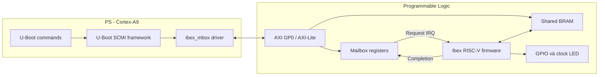
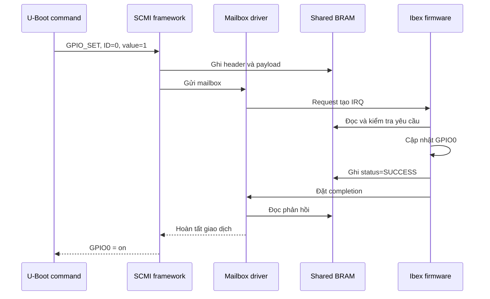

# Báo cáo tích hợp Ibex firmware và SCMI trên EBAZ4205

**Dự án:** EBAZ4205-PetaLinux / `ibex_min`  
**Ngày lập:** 04/10/2026  
**Phạm vi:** RTL, firmware Ibex, SCMI, FSBL, U-Boot, nút S2 và cập nhật `BOOT.BIN` qua JTAG

## 1. Tổng quan kết quả

Hệ thống đã tích hợp một lõi Ibex RISC-V trong phần PL của Zynq-7000. Firmware do dự án tự xây dựng chạy trực tiếp trên Ibex và cung cấp dịch vụ SCMI cho U-Boot chạy trên Cortex-A9 phía PS.

U-Boot có thể gửi lệnh qua mailbox và shared memory, chờ Ibex xử lý, nhận mã trạng thái cùng dữ liệu trả về, sau đó hiển thị kết quả trên UART.

Các phần đã thực hiện:

- Xây dựng firmware Ibex độc lập và nhúng firmware vào ROM BRAM của bitstream.
- Cài đặt SCMI Base 2.0, SCMI Clock 1.0 và giao thức GPIO riêng ID `0x80`.
- Xây dựng mailbox, shared memory và ngắt từ PS tới Ibex trong RTL.
- Xây dựng driver mailbox và các lệnh điều khiển trong U-Boot.
- Build lại FSBL và U-Boot theo thiết kế RTL `ibex_min`.
- Đóng gói FSBL, bitstream và U-Boot tùy biến thành `BOOT.BIN`.
- Cấp FCLK1 25 MHz từ giai đoạn khởi động để Ibex, AXI và mailbox hoạt động trước khi U-Boot kết nối SCMI.
- Điều khiển GPIO, clock LED và đọc lại trạng thái từ U-Boot.
- Bổ sung reset bằng nút S2 trong U-Boot.
- Bổ sung cơ chế cập nhật riêng `BOOT.BIN` trên thẻ SD qua JTAG.

Ảnh boot hiện tại gồm:

```text
BOOT.BIN
├── FSBL tùy biến
├── Bitstream ibex_min
└── U-Boot tùy biến
```

`image.ub` và `boot.scr` của PetaLinux được giữ nguyên trong lần cập nhật này.

## 2. Kiến trúc hệ thống



Các thành phần có vai trò như sau:

| Thành phần | Vị trí | Chức năng |
|---|---|---|
| `ibexinit`, `pmu_gpio`, `pmu_clock` | U-Boot trên PS | Nhận lệnh từ UART và tạo yêu cầu SCMI |
| SCMI framework | U-Boot | Đóng gói header, token và payload |
| `ibex_mbox` | U-Boot | Kiểm tra phần cứng, phát request và đợi completion |
| AXI GP0 | PS → PL | Cho PS truy cập thanh ghi và shared BRAM |
| Mailbox RTL | PL | Giữ request/completion và phát IRQ tới Ibex |
| Shared BRAM | PL | Chứa yêu cầu và phản hồi SCMI |
| Firmware SCMI | Ibex | Kiểm tra, xử lý lệnh và trả kết quả |
| GPIO/clock RTL | PL | Điều khiển LED6 và các chân DATA1 |

U-Boot không ghi trực tiếp GPIO. Mọi thay đổi trạng thái đều được gửi tới firmware Ibex bằng SCMI.

## 3. Clock và reset

Thiết kế cấu hình hai clock từ PS:

| Clock | Tần số | Mục đích |
|---|---:|---|
| FCLK0 | 100 MHz | Clock hệ thống khác trong thiết kế |
| FCLK1 | 25 MHz | Ibex, AXI bridge, mailbox và reset synchronizer |

Device tree U-Boot tham chiếu FCLK1 bằng clock ID `16`.

FSBL khởi tạo PS, DDR, UART và clock, sau đó nạp bitstream. Firmware Ibex nằm trong ROM BRAM của bitstream nên bắt đầu chạy trước khi U-Boot khởi tạo SCMI.

Driver mailbox hiện tại:

- Kiểm tra PL đã được cấu hình.
- Kiểm tra FCLK1 nằm trong khoảng 24,9–25,1 MHz.
- Kiểm tra reset đã được nhả.
- Chờ firmware ghi ready signature.
- Kết nối với firmware đang chạy, không reset hoặc nạp lại firmware.

## 4. Bản đồ địa chỉ

### 4.1. Địa chỉ phía PS

| Địa chỉ | Chức năng |
|---|---|
| `0x43C00000` | Request/doorbell |
| `0x43C00004` | Completion |
| `0x43C00008` | Ready signature `0x49424558` (`IBEX`) |
| `0x43C00010` | Bitmap trạng thái GPIO |
| `0x43C00014` | Trap cause do firmware lưu |
| `0x43C00018` | Trạng thái CPU fault, chỉ đọc từ PS |
| `0x43C0001C` | Bộ đếm ngắt đã xử lý |
| `0x43C00020` | Trạng thái Ibex đang ngủ/chờ |
| `0x43C00024` | Clock LED enable |
| `0x43C00028` | Tần số clock LED, đơn vị Hz |
| `0x43C01000..0x43C01FFF` | Shared memory SCMI, 4 KiB |

### 4.2. Địa chỉ phía Ibex

| Địa chỉ | Kích thước | Chức năng |
|---|---:|---|
| `0x00000000` | 16 KiB | ROM firmware |
| `0x10000000` | 8 KiB | RAM dữ liệu và stack |
| `0x20000000` | 4 KiB | Shared memory SCMI |
| `0x30000000` | Vùng thanh ghi | Mailbox, GPIO và chẩn đoán |

Vùng `0x43C01000` phía PS và `0x20000000` phía Ibex là cùng một BRAM hai cổng. Không cần sao chép bản tin SCMI qua DDR.

## 5. Firmware Ibex

Firmware chạy bare-metal và không phụ thuộc hệ điều hành. Mã khởi động thiết lập vector, stack và vùng dữ liệu. Vòng lặp chính đưa CPU vào trạng thái chờ bằng `WFI`.

Khi U-Boot ghi request:

1. Mailbox RTL phát ngắt mức tới Ibex.
2. Ibex thức khỏi `WFI` và vào trình xử lý ngắt.
3. Firmware xóa request và tăng bộ đếm ngắt.
4. Firmware đọc, kiểm tra và xử lý bản tin trong shared memory.
5. Kết quả được ghi lại vào shared memory.
6. Firmware đánh dấu kênh rảnh và ghi completion.
7. U-Boot đọc phản hồi và hiển thị kết quả.

### 5.1. Các giao thức SCMI

| Protocol | ID | Phiên bản | Chức năng |
|---|---:|---:|---|
| Base | `0x10` | 2.0 | Discovery vendor, implementation, agent và protocol |
| Clock | `0x14` | 1.0 | Đọc/cấu hình trạng thái và tần số clock |
| GPIO riêng | `0x80` | 1.0 | Điều khiển và đọc GPIO |

Các mã trạng thái được dùng:

| Trạng thái | Giá trị |
|---|---:|
| `SCMI_SUCCESS` | `0` |
| `SCMI_NOT_SUPPORTED` | `-1` |
| `SCMI_INVALID_PARAMETERS` | `-2` |
| `SCMI_NOT_FOUND` | `-3` |

### 5.2. Định dạng shared memory

| Offset | Trường | Ý nghĩa |
|---:|---|---|
| `0x04` | `channel_status` | Bit 0 bằng 1 khi kênh rảnh |
| `0x10` | `flags` | Cờ SMT |
| `0x14` | `length` | Độ dài header và payload |
| `0x18` | `message_header` | Header SCMI 32 bit |
| `0x1C` | `payload` | Vùng dữ liệu truyền và nhận |

Header SCMI 32 bit:

| Bit | Trường |
|---|---|
| `[7:0]` | Message ID |
| `[9:8]` | Message type |
| `[17:10]` | Protocol ID |
| `[27:18]` | Token |
| `[31:28]` | Reserved |

Firmware giữ nguyên token trong phản hồi để client ghép đúng giao dịch.

## 6. Dịch vụ GPIO

GPIO sử dụng protocol riêng `0x80`:

| Message | ID | Payload gửi | Payload nhận |
|---|---:|---|---|
| `GPIO_SET` | `3` | GPIO ID, value | Status |
| `GPIO_GET` | `4` | GPIO ID | Status, value |

Các ngõ ra hiện có:

| GPIO ID | Chức năng |
|---:|---|
| `0` | LED6 xanh |
| `1` | DATA1 chân 5 |
| `2` | DATA1 chân 6 |
| `3` | DATA1 chân 7 |
| `4` | DATA1 chân 8 |

Firmware lưu trạng thái GPIO thành bitmap để U-Boot có thể đọc lại.

## 7. Dịch vụ Clock

Clock ID `0` điều khiển LED6 đỏ.

- Tần số cho phép: 1–100 Hz.
- Giá trị mặc định sau reset: 1 Hz.
- Trạng thái mặc định: tắt.
- `RATE_SET` thay đổi tần số nhưng không tự bật clock.
- `CONFIG_SET` bật hoặc tắt nhưng giữ nguyên tần số đã cấu hình.

Các message đã hỗ trợ:

| Message | ID | Chức năng |
|---|---:|---|
| `CLOCK_ATTRIBUTES` | `3` | Đọc thuộc tính và trạng thái enable |
| `CLOCK_DESCRIBE_RATES` | `4` | Trả về min=1, max=100, step=1 |
| `CLOCK_RATE_SET` | `5` | Đặt tần số |
| `CLOCK_RATE_GET` | `6` | Đọc tần số |
| `CLOCK_CONFIG_SET` | `7` | Bật hoặc tắt clock |

RTL dùng bộ tích lũy pha theo nguồn 25 MHz. Cách này tạo được tần số trung bình chính xác cho mọi giá trị nguyên từ 1 đến 100 Hz, kể cả khi 25.000.000 không chia hết cho tần số yêu cầu.

## 8. Tích hợp U-Boot

### 8.1. Device tree

Device tree khai báo:

- Mailbox tại `0x43C00000`, kích thước `0x1000`.
- Shared SRAM tại `0x43C01000`, kích thước `0x1000`.
- Clock FCLK1 từ PS.
- S2 reset tại MIO20, active-high.
- SCMI agent tại `/firmware/scmi`.

Node SCMI được để `status = "disabled"` để tránh discovery khi console và phần cứng chưa sẵn sàng. Lệnh `ibexinit` bind node theo yêu cầu sau khi U-Boot đã lên UART.

### 8.2. Driver mailbox

Driver `ibex-mbox.c` thực hiện:

- Xác nhận PL, clock và reset ở trạng thái hợp lệ.
- Chờ ready signature `IBEX`.
- Ghi request để kích hoạt IRQ phía Ibex.
- Polling completion để nhận phản hồi.
- In log TX/RX và trạng thái các thanh ghi phục vụ chẩn đoán.

Phía PS hiện dùng polling để chờ kết quả. Thiết kế chưa sử dụng IRQ từ PL tới GIC của PS cho completion.

## 9. Các lệnh U-Boot

### 9.1. Khởi tạo SCMI

```text
ibexinit
```

Kết quả mong đợi:

```text
Ibex: binding SCMI after console startup
Ibex SCMI ready
```

Các lệnh `pmu_gpio` và `pmu_clock` cũng tự khởi tạo agent nếu `ibexinit` chưa được chạy.

### 9.2. Điều khiển GPIO

```text
pmu_gpio on
pmu_gpio off
pmu_gpio get

pmu_gpio 0 on
pmu_gpio 0 get
pmu_gpio 1 on
pmu_gpio 4 off
```

Cú pháp không có ID mặc định dùng GPIO0. Cú pháp có ID hỗ trợ GPIO0..4.

Kết quả ví dụ:

```text
PMU GPIO0: on
PMU GPIO0: off
```

### 9.3. Điều khiển clock LED6 đỏ

```text
pmu_clock set 10
pmu_clock rate
pmu_clock on
pmu_clock get
pmu_clock set 100
pmu_clock off
```

`set` chỉ chấp nhận số nguyên từ 1 đến 100. `rate` đọc tần số hiện tại và `get` đọc thuộc tính cùng trạng thái enable.

## 10. Ví dụ luồng `pmu_gpio 0 on`



Hai lớp lỗi được phân biệt:

- `transport`: lỗi driver, mailbox hoặc SCMI framework phía U-Boot.
- `status`: lỗi xử lý yêu cầu do firmware SCMI trả về.

## 11. FSBL, bitstream và đóng gói BOOT.BIN

Các thành phần được đóng gói:

| Thành phần | File |
|---|---|
| FSBL | `vivado/ibex_min/fsbl_new/executable.elf` |
| Bitstream | `vivado/ibex_min/ibex_min.bit` |
| U-Boot | `vivado/ibex_min/uboot/u-boot-ibex.elf` |

Ảnh đầu ra:

```text
E:\EBAZ4205-build\BOOT.BIN
```

Thông tin ảnh tại thời điểm lập tài liệu:

```text
Kích thước: 3.170.808 byte
SHA-256: 341C754B52880A9B590558B0C83CDC8DD6BFC9B7E6C6BFBF3ECA99AC6285C09E
```

Ảnh tương ứng trong cây dự án:

```text
vivado/ibex_min/BOOT-PETALINUX-IBEX.BIN
```

Boot command mặc định:

```text
ibexinit; fatload mmc 0:1 0x03000000 image.ub; bootm 0x03000000
```

Autoboot hiện được tắt bằng `CONFIG_BOOTDELAY=-1`. Sau khi khởi động, bo dừng tại
dấu nhắc U-Boot để người dùng chạy `ibexinit`, các lệnh SCMI hoặc khởi động Linux
thủ công.

## 12. Reset bằng nút S2

S2 được nối với PS MIO20, active-high và có pulldown ngoài. U-Boot đăng ký cyclic polling để đọc trạng thái nút.

Khi phát hiện thao tác nhả rồi nhấn S2, U-Boot gọi:

```c
zynq_slcr_cpu_reset();
```

Hệ thống quay lại BootROM, sau đó FSBL chạy lại và nạp lại bitstream PL.

Chức năng này chạy bên trong U-Boot. Sau khi Linux đã khởi động, U-Boot không còn thực thi nên S2 không còn được U-Boot polling. Muốn S2 hoạt động trong Linux cần bổ sung driver hoặc dịch vụ tương ứng vào Linux. Bản cập nhật hiện tại không build lại image Linux.

## 13. Cập nhật BOOT.BIN qua JTAG

Lệnh `jtag_sd_update` trong U-Boot chỉ cập nhật `BOOT.BIN` trên phân vùng FAT của thẻ SD.

- Ghi đè trực tiếp, không tạo bản sao lưu.
- Không thay đổi `image.ub`.
- Không thay đổi `boot.scr`.
- Dữ liệu JTAG được đặt tại DDR `0x08000000`.
- Descriptor được đặt tại `0x07FFF000`.
- Kích thước tối đa 32 MiB.
- Có kiểm tra CRC32 và đọc lại dữ liệu.

Trên U-Boot:

```text
jtag_sd_update
```

Trên Windows:

```text
vivado\ibex_min\jtag-copy-boot-to-sd.cmd
```

Sau khi U-Boot báo hoàn tất, reset CPU hoặc cấp nguồn lại để BootROM nạp `BOOT.BIN` mới.

## 14. Quy trình build đã thực hiện

1. Biên dịch firmware bằng toolchain RISC-V.
2. Chuyển firmware thành `firmware.hex` để nhúng vào ROM RTL.
3. Tổng hợp thiết kế `ibex_min` bằng Vivado để tạo bitstream.
4. Build FSBL từ hardware description tương ứng với RTL.
5. Script `build-client.sh` đưa driver, command và device tree tùy biến vào cây U-Boot.
6. Bật các cấu hình SCMI, mailbox, cyclic, GPIO và các chức năng liên quan.
7. Build `u-boot-ibex.elf`.
8. Dùng Bootgen đóng gói FSBL, bitstream và U-Boot thành `BOOT.BIN`.

Trong lần cập nhật gần nhất chỉ cần thay `BOOT.BIN`. Không cần build lại toàn bộ PetaLinux để kiểm tra U-Boot và SCMI.

## 15. Checklist kiểm tra trên bo

1. Mở UART và cấp nguồn cho bo.
2. Xác nhận FSBL chuyển sang U-Boot bình thường.
3. Dừng autoboot nếu cần thao tác thủ công.
4. Chạy `ibexinit`; xác nhận có `Ibex SCMI ready`.
5. Chạy `pmu_gpio 0 on`, `off`, `get`; kiểm tra LED6 xanh.
6. Chạy các GPIO1..4; đo DATA1 chân 5..8 và so sánh với kết quả `get`.
7. Chạy `pmu_clock set 1`, sau đó `pmu_clock on`; kiểm tra LED6 đỏ.
8. Lặp lại với 10 Hz và 100 Hz; dùng oscilloscope hoặc logic analyzer ở tần số cao.
9. Chạy `pmu_clock rate` và `pmu_clock get`; xác nhận tần số và enable đúng.
10. Thử đặt 0 Hz và 101 Hz; xác nhận lệnh bị từ chối và trạng thái cũ không đổi.
11. Nhả rồi nhấn S2 khi còn ở U-Boot; xác nhận hệ thống chạy lại BootROM và FSBL.
12. Cho autoboot Linux; xác nhận `image.ub` hiện có vẫn khởi động với `BOOT.BIN` mới.

## 16. Giới hạn và lưu ý

- U-Boot chờ completion bằng polling; chưa có IRQ completion từ PL tới GIC của PS.
- Không nên dùng `md.l` đọc AXI PL trước khi phần cứng và clock sẵn sàng. Slave AXI đang reset có thể làm bus bị treo.
- S2 chỉ được U-Boot xử lý trong thời gian U-Boot còn chạy.
- `BOOT.BIN`, FSBL, bitstream, U-Boot và device tree phải cùng phiên bản RTL.
- Cần lưu log UART khi nghiệm thu trên bo để xác nhận hoạt động thực tế.

## 17. Các file nguồn chính

| File | Nội dung |
|---|---|
| `vivado/ibex_min/ibex_min_top.v` | Top-level và kết nối clock 25 MHz |
| `vivado/ibex_min/ibex_ps_bd.tcl` | Cấu hình PS, FCLK và địa chỉ AXI |
| `vivado/ibex_min/rtl/ibex_soc.v` | SoC, mailbox, GPIO và clock LED |
| `vivado/ibex_min/firmware/server.c` | SCMI server trên Ibex |
| `vivado/ibex_min/firmware/scmi_protocols.h` | Protocol, message và register ID |
| `vivado/ibex_min/uboot/ibex-mbox.c` | Driver mailbox U-Boot |
| `vivado/ibex_min/uboot/ibex-gpio.c` | `ibexinit`, `pmu_gpio`, `pmu_clock` |
| `vivado/ibex_min/uboot/ibex-scmi.dtsi` | Device tree SCMI |
| `vivado/ibex_min/uboot/s2-reset.c` | Reset bằng nút S2 |
| `vivado/ibex_min/uboot/jtag-sd-update.c` | Ghi `BOOT.BIN` từ DDR xuống SD |
| `vivado/ibex_min/uboot/build-client.sh` | Build U-Boot tùy biến |
| `vivado/ibex_min/jtag-copy-boot-to-sd.ps1` | Truyền `BOOT.BIN` qua JTAG |

## 18. Kết luận

Thiết kế đã tạo được kênh quản lý hoàn chỉnh giữa U-Boot trên PS và firmware Ibex trong PL. Clock và phần cứng được hình thành từ giai đoạn FSBL. U-Boot khởi tạo SCMI theo yêu cầu, gửi lệnh qua shared memory và mailbox, nhận kết quả rồi đọc lại trạng thái.

GPIO, clock LED, S2 reset và cơ chế cập nhật riêng `BOOT.BIN` đã được tích hợp vào luồng boot. Bước tiếp theo là chạy checklist trên bo và lưu log UART để xác nhận toàn bộ chức năng với phần cứng thực tế.
