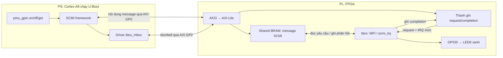
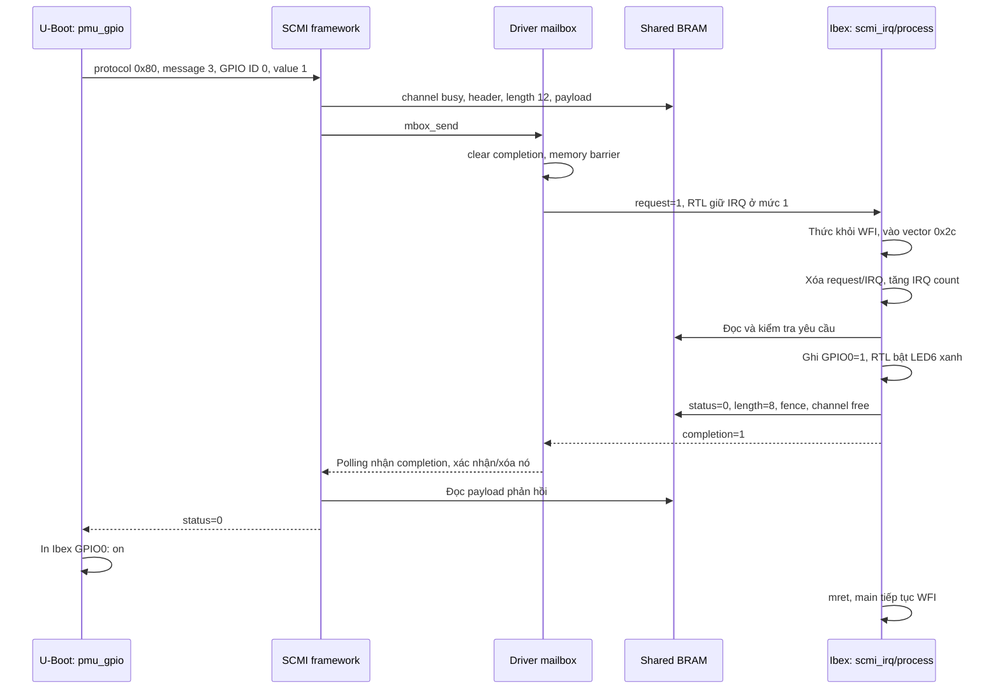

# Luồng giao tiếp U-Boot ↔ Ibex bằng SCMI trên EBAZ4205

> Cập nhật: driver mailbox hiện chỉ kết nối với Ibex đã chạy từ lúc khởi động
> hệ thống; không cấu hình lại clock hoặc giữ/nhả reset. FSBL phải chuẩn bị
> FCLK1 25 MHz và nhả reset. Các phần mô tả driver tự cấu hình clock/reset
> trong tài liệu này thuộc bản cũ. `BOOT.BIN` mới ngày 2026-10-04 dùng FSBL
> build từ HDF bằng SDK 2015.1 và U-Boot đã build lại; chưa thử trên bo.

Tài liệu này mô tả **bản RTL/firmware dùng ngắt đang có trong thư mục này**:
PS chạy U-Boot 2025.10, Ibex chạy trong PL, firmware nằm trong ROM BRAM.
U-Boot gửi lệnh SCMI; Ibex xử lý và điều khiển GPIO0/LED6 xanh.

**Ibex nhận yêu cầu bằng ngắt; U-Boot chờ kết quả bằng polling.** Hai hướng
không bắt buộc dùng cùng cơ chế báo hiệu. Chưa có IRQ từ PL tới GIC của PS.

## 1. Vai trò của từng phần

| Phần | Chạy ở đâu | Làm gì |
|---|---|---|
| `pmu_gpio` | U-Boot trên Cortex-A9/PS | Chuyển `on/off/get` thành message SCMI |
| SCMI framework | U-Boot trên PS | Đóng gói message vào shared memory, gọi mailbox, lấy phản hồi |
| Driver `ibex_mbox` | U-Boot trên PS | Khởi tạo clock/reset, đặt request, kiểm tra completion |
| AXI-Lite slave | RTL trong PL | Cho PS truy cập thanh ghi và shared BRAM |
| Mailbox | RTL trong PL | Giữ request/completion; request tạo IRQ cho Ibex |
| Shared memory | BRAM trong PL | Chứa nội dung yêu cầu và phản hồi SCMI |
| `scmi_irq()` / `process()` | Firmware trên Ibex | Nhận ngắt, kiểm tra và xử lý message, trả kết quả |
| GPIO | RTL trong PL | Chuyển giá trị firmware ghi thành mức điện trên chân LED |

SCMI là cách tổ chức lệnh và phản hồi. **AXI** là đường PS truy cập phần cứng
PL. **Mailbox** là cơ chế báo hiệu. **Shared memory** là nơi chứa message.
Việc ghi một message chưa tự tạo ngắt: PS phải ghi thêm thanh ghi request.



## 2. Các file nên đọc

| File trong thiết kế này | Nội dung |
|---|---|
| [firmware/server.c](../../../vivado/ibex_min/firmware/server.c) | SCMI server, ISR, vòng chờ WFI; đã có comment tiếng Việt |
| [firmware/start.S](../../../vivado/ibex_min/firmware/start.S) | Reset vector, vector ngắt, stack, khởi tạo RAM, trap |
| [firmware/link.ld](../../../vivado/ibex_min/firmware/link.ld) | Địa chỉ ROM/RAM, vị trí section, stack |
| [rtl/ibex_cpu.sv](../../../vivado/ibex_min/rtl/ibex_cpu.sv) | Ghép lõi Ibex, register file, IRQ và tín hiệu ngủ |
| [rtl/ibex_soc.v](../../../vivado/ibex_min/rtl/ibex_soc.v) | ROM/RAM, giải mã địa chỉ, mailbox, AXI-Lite, GPIO |
| [rtl/ibex_shared_ram.v](../../../vivado/ibex_min/rtl/ibex_shared_ram.v) | Shared BRAM hai cổng, hỗ trợ ghi từng byte |
| [build.tcl](../../../vivado/ibex_min/build.tcl) | Block design PS7, AXI converter, clock/reset và tổng hợp |
| [uboot/ibex-mbox.c](../../../vivado/ibex_min/uboot/ibex-mbox.c) | Driver mailbox cho U-Boot |
| [uboot/ibex-gpio.c](../../../vivado/ibex_min/uboot/ibex-gpio.c) | Lệnh `ibexinit`, `pmu_gpio`; đã có comment tiếng Việt |
| [uboot/ibex-scmi.dtsi](../../../vivado/ibex_min/uboot/ibex-scmi.dtsi) | Khai báo mailbox, shared memory, SCMI agent |
| [uboot/build-client.sh](../../../vivado/ibex_min/uboot/build-client.sh) | Đưa các file vào cây U-Boot, bật config và build |
| [prepare.ps1](../../../vivado/ibex_min/prepare.ps1) | Build firmware RISC-V, tạo ROM hex, chuyển SystemVerilog bằng sv2v |

`ibex_cpu.v` là file sinh từ `ibex_cpu.sv` và mã upstream bằng sv2v. Khi muốn
sửa nối IRQ/cấu hình CPU, sửa nguồn `.sv` rồi chạy `prepare.ps1`.

## 3. Bản đồ địa chỉ: PS và Ibex nhìn khác nhau

### 3.1. Vùng nhớ phía Ibex

| Địa chỉ | Kích thước | Chức năng |
|---|---:|---|
| `0x00000000` | 16 KiB | ROM lệnh và hằng số firmware |
| `0x10000000` | 8 KiB | RAM biến và stack |
| `0x20000000` | 4 KiB | Shared memory SCMI |
| `0x30000000` | 32 byte | Thanh ghi mailbox/GPIO/chẩn đoán |

ROM, RAM và shared memory đều là BRAM trong PL. RAM của Ibex không nằm trong
DDR của PS. Firmware được nhúng vào bitstream bằng `firmware.hex`.

### 3.2. Những thanh ghi PS có thể đọc

| Offset | Địa chỉ PS | Địa chỉ Ibex | Ý nghĩa |
|---|---|---|---|
| `0x00` | `0x43C00000` | `0x30000000` | Request, bit 0 |
| `0x04` | `0x43C00004` | `0x30000004` | Completion, bit 0 |
| `0x08` | `0x43C00008` | `0x30000008` | Ready magic `0x49424558` |
| `0x10` | `0x43C00010` | `0x30000010` | Giá trị GPIO0: 0=tắt, 1=bật |
| `0x14` | `0x43C00014` | `0x30000014` | Mã trap bất thường do firmware lưu |
| `0x18` | `0x43C00018` | — | CPU fault, chỉ đọc từ PS |
| `0x1C` | `0x43C0001C` | `0x3000001C` | Bộ đếm IRQ do firmware tăng |
| `0x20` | `0x43C00020` | — | CPU sleeping: 1=đang chờ, 0=hoạt động |

PS chỉ được ghi request, completion và shared memory. PS không ghi trực tiếp
GPIO trong bản này; firmware Ibex sở hữu GPIO. Giá trị GPIO là mức logic
on/off; RTL đảo mức để LED6 xanh W13 active-low hoạt động đúng.

### 3.3. Shared memory

| Bên truy cập | Địa chỉ |
|---|---|
| PS | `0x43C01000..0x43C01FFF` |
| Ibex | `0x20000000..0x20000FFF` |

Đây là **cùng một BRAM**, truy cập qua hai cổng với hai cách giải mã địa chỉ.
Không có thao tác copy từ DDR PS sang RAM Ibex giữa hai địa chỉ này.

Địa chỉ PS `0x43C00000` được gán trong block design; các địa chỉ phía Ibex
được giải mã trong `ibex_soc.v`. DTS chỉ mô tả lại các địa chỉ đã thiết kế,
không tự tạo phần cứng ở địa chỉ đó.

## 4. Message SCMI được đặt trong BRAM như thế nào?

Trong C phía Ibex:

```c
#define SHM ((volatile u32 *)0x20000000u)
```

`SHM[n]` là word 32 bit tại `base + n*4`, không phải byte thứ n.

| Offset byte | Word Ibex | Trường SMT | Ý nghĩa |
|---|---|---|---|
| `0x00` | `SHM[0]` | reserved | Chưa dùng |
| `0x04` | `SHM[1]` | channel_status | Bit 0=1: free; =0: busy |
| `0x08..0x0C` | `SHM[2..3]` | reserved | Chưa dùng |
| `0x10` | `SHM[4]` | flags | Server hiện không tạo IRQ completion về PS |
| `0x14` | `SHM[5]` | length | Số byte message header + payload |
| `0x18` | `SHM[6]` | message header | Mã protocol/lệnh/type/token |
| `0x1C...` | `SHM[7...]` | payload | Tham số yêu cầu hoặc dữ liệu trả về |

Header message 32 bit có các trường:

| Bits | Trường |
|---|---|
| `[7:0]` | Message ID |
| `[9:8]` | Message type; command dùng 0 |
| `[17:10]` | Protocol ID |
| `[27:18]` | Token để nhận diện giao dịch |
| `[31:28]` | Reserved |

`process()` lấy protocol bằng `(header >> 10) & 255`, lấy message ID bằng
`header & 255`. Nó không ghi lại header, nên token được giữ khi trả lời.
Client U-Boot hiện dùng token 0; test mô phỏng dùng token khác để kiểm tra
server giữ nguyên token.

`length` không tính 24 byte metadata đứng trước message header. Ví dụ
GPIO_SET có header 4 byte và hai tham số 4 byte: `length = 12`.

## 5. Luồng khởi động và lệnh ibexinit

### 5.1. Trước dấu nhắc U-Boot

1. BootROM chạy FSBL từ `BOOT.BIN`.
2. FSBL khởi tạo PS/DDR/UART, nạp bitstream PL rồi chuyển sang U-Boot.
3. U-Boot dựng Driver Model và đọc device tree.
4. Node SCMI đang để `status = "disabled"`, nên quét DT không tự bind nó.
5. U-Boot lên console. Chưa nên đọc AXI PL bằng `md.l` trước khởi tạo driver.

FSBL đang được giữ lại từ ảnh gốc đã boot được; nó có thể chưa đặt FCLK1
đúng cho thiết kế mới. Driver mailbox sẽ chuẩn bị clock/reset trước giao tiếp.

### 5.2. Khi gõ ibexinit

`do_ibexinit()` gọi `ibex_init_agent()` trong `ibex-gpio.c`:

1. Tìm SCMI agent đã bind; nếu đã có thì dùng lại.
2. Nếu chưa có, lấy node `/firmware/scmi` rồi gọi `lists_bind_fdt()` trực tiếp.
3. Cơ chế bind trực tiếp này cho phép bind node đã để disabled; bước lọc
   disabled chỉ được dùng khi quét DT tự động.
4. Uclass SCMI tự tạo Base protocol và thực hiện discovery ngay ở `post_bind`.
5. Khi transport cần mailbox, driver `ibex_mbox` được probe.

Trong `ibex_probe()` của driver mailbox:

1. Kiểm tra cờ PL đã được cấu hình trong DEVCFG.
2. Lấy địa chỉ mailbox từ `reg` và clock từ `clocks` của DTS.
3. Giữ reset PL tương ứng FCLK1, đặt FCLK1 khoảng 25 MHz bằng API clock Zynq.
4. Bật level shifter PS–PL, nhả reset FCLK1.
5. Đọc ready cho đến khi thấy `0x49424558` hoặc hết số lần chờ.
6. SCMI transport thiết lập shared buffer; Base discovery trao đổi với Ibex.
7. Nếu thành công, `ibexinit` in `Ibex SCMI ready`.

**Vì sao phải trì hoãn?** U-Boot 2025.10 thực hiện discovery SCMI ngay lúc
bind, không chờ người dùng gọi `scmi info`. Nếu cho nó bind trong boot,
một lần truy cập AXI chưa sẵn sàng có thể khiến U-Boot đứng trước console.

Giới hạn vòng chờ ready/timeout SCMI chỉ có tác dụng khi thao tác đọc AXI
trả về. Nếu slave AXI bị giữ reset hoặc không trả response, một `readl()`
có thể bị chặn; vòng chờ phần mềm không tự cứu được bus đang kẹt.

## 6. Luồng cụ thể của pmu_gpio on



`pmu_gpio` tự gọi `ibex_init_agent()` nếu chưa khởi tạo. Chạy `ibexinit`
riêng trước vẫn hữu ích để xem log clock/reset/discovery.

Payload SET gửi từ U-Boot:

```c
u32 in[2] = {0, 1}; /* GPIO ID 0, value 1 */
/* msg.protocol_id=0x80; message_id=3; in_msg_sz=8; out_msg_sz=4 */
```

Với token 0, header SET là `0x00020003`. Ibex trả payload chỉ có status
4 byte; tính thêm header, response `length = 8`.

GET dùng message ID 4, chỉ gửi GPIO ID 0 (4 byte), nhận status + value
(8 byte). Request `length = 8`; response thành công `length = 12`.

## 7. Firmware Ibex phải khai báo và handle những gì?

### 7.1. Khởi động, bộ nhớ và vector

`start.S` và `link.ld` cần bảo đảm:

- ROM bắt đầu ở 0; reset entry của Ibex ở offset `0x80`.
- Stack nằm cuối RAM `0x10002000`, có vùng dự phòng ít nhất 2 KiB.
- Copy `.data` từ ROM sang RAM, xóa `.bss`, chuẩn bị `gp` rồi gọi `main()`.
- Ibex ở cấu hình này dùng `mtvec` vectored, base căn 256 byte. Base đang là 0.
- Vector machine external interrupt là `0 + 4*11 = 0x2C`.
- Tại `0x2C` đặt `j scmi_irq`; tại base 0 đặt nhánh xử lý trap bất thường.

`main()` bật ngắt rồi công bố ready:

```c
__asm__ volatile("csrw mie, %0" :: "r"(1u << 11) : "memory");
__asm__ volatile("csrsi mstatus, 8" ::: "memory");
/* mie.MEIE bit 11: bật machine external IRQ.
 * mstatus.MIE bit 3: bật ngắt toàn cục. */
```

Sau đó `main()` chỉ lặp lệnh `wfi`. Không polling thanh ghi request.
WFI làm lõi ngừng phát lệnh khi rảnh; clock PL vẫn chạy, chưa có clock gating.

### 7.2. Hàm phục vụ ngắt scmi_irq()

Hàm được khai báo:

```c
__attribute__((interrupt("machine"))) void scmi_irq(void)
```

Thuộc tính GCC làm compiler lưu/khôi phục các thanh ghi cần bảo vệ và sinh
`mret` thay cho return thông thường. Khi CPU vào ngắt, MIE bị tạm tắt;
`mret` khôi phục trạng thái nhận ngắt và PC của chương trình bị ngắt.

ISR hiện làm:

1. Đọc `mcause`; chỉ chấp nhận `0x8000000B`, tức ngắt machine external 11.
2. Nếu bất thường, ghi trap cause và dừng để chẩn đoán.
3. `fence()` rồi ghi request=0 để hạ IRQ mức.
4. Tăng bộ đếm IRQ.
5. Nếu channel busy, gọi `process()`; nếu channel vẫn free thì bỏ qua message.

Request được giữ trong flip-flop RTL đến khi firmware xóa. Nó không phải
xung một chu kỳ, nên một yêu cầu đến gần lúc CPU vào WFI vẫn còn pending.
ISR không bật ngắt lồng; server xử lý một yêu cầu mỗi lần.

### 7.3. Hàm process()

Các biến chính:

| Biến | Ý nghĩa |
|---|---|
| `length`, `header` | Độ dài và header lấy từ shared memory |
| `protocol`, `id` | Protocol ID và message ID tách từ header |
| `arg0`, `arg1` | Hai word tham số đầu, giữ lại trước khi ghi đè phản hồi |
| `out` | Con trỏ payload phản hồi tại `SHM[7]` |
| `status` | Mã thành công/lỗi có dấu |
| `words` | Số word payload phản hồi, tính cả status |

Hàm kiểm tra độ dài, message type, protocol và message ID. Sau khi xử lý,
nó ghi status/dữ liệu, cập nhật length, `fence`, đặt channel free, `fence`,
rồi đặt completion=1. Header/token giữ nguyên.

### 7.4. Những message đang được hỗ trợ

Base protocol `0x10`, phiên bản `2.0`:

| ID | Lệnh | Kết quả chính |
|---:|---|---|
| 0 | PROTOCOL_VERSION | `0x00020000` |
| 1 | PROTOCOL_ATTRIBUTES | 2 agent, 1 protocol ngoài Base |
| 2 | PROTOCOL_MESSAGE_ATTRIBUTES | Kiểm tra một message ID có hỗ trợ |
| 3 | DISCOVER_VENDOR | `EBAZ4205` |
| 4 | DISCOVER_SUB_VENDOR | `Ibex` |
| 5 | DISCOVER_IMPLEMENTATION_VERSION | `1` |
| 6 | DISCOVER_LIST_PROTOCOLS | Protocol riêng `0x80` |
| 7 | DISCOVER_AGENT | Agent 0=`platform`, 1=`U-Boot`; ID `0xFFFFFFFF` hỏi agent đang gọi |

Hai agent không có nghĩa là hai client PS đồng thời: hiện chỉ có một client
ngoài firmware, PS/U-Boot; agent 0 đại diện platform.

GPIO protocol riêng `0x80`, phiên bản `1.0`:

| ID | Lệnh | Tham số | Payload phản hồi thành công |
|---:|---|---|---|
| 0 | VERSION | Không | status + version |
| 1 | ATTRIBUTES | Không | status + số GPIO (`1`) |
| 2 | MESSAGE_ATTRIBUTES | Message ID cần hỏi | status + attributes |
| 3 | GPIO_SET | GPIO ID, value | status |
| 4 | GPIO_GET | GPIO ID | status + value |

Chỉ GPIO ID 0 hợp lệ; value chỉ 0/1. Đây là protocol tự định nghĩa của thiết
kế này; các message SET/GET phải thống nhất giữa U-Boot và firmware.

Mã status: `0` thành công, `-1` không hỗ trợ, `-2` tham số sai, `-3` không
tìm thấy ID. Base ID 8/notifications, clock, power, performance và các
protocol SCMI khác chưa được triển khai.

## 8. U-Boot phải thêm gì?

### 8.1. Driver mailbox ibex-mbox.c

Copy file vào cây U-Boot:

```text
uboot/ibex-mbox.c → drivers/mailbox/ibex-mbox.c
```

Driver khai báo `U_BOOT_DRIVER(ibex_mbox)`, thuộc `UCLASS_MAILBOX`, match
compatible `ebaz4205,ibex-mailbox`. `struct ibex_mbox` giữ con trỏ thanh ghi.

| Hàm/callback | Công việc |
|---|---|
| `ibex_probe()` | Chuẩn bị PL clock/reset, map địa chỉ, chờ firmware ready |
| `ibex_request()` | Chỉ chấp nhận mailbox channel ID 0 |
| `ibex_send()` | Kiểm tra ready/request, xóa completion cũ, barrier, đặt request=1 |
| `ibex_recv()` | Nếu chưa complete trả `-ENODATA`; nếu có thì barrier và xóa completion |
| `ibex_free()` | Không có tài nguyên channel riêng cần giải phóng |

Mailbox không chép payload: SCMI framework làm phần đó. Callback send/recv
nhận con trỏ dữ liệu nhưng driver này chỉ dùng thanh ghi doorbell.
SCMI mailbox transport hiện chờ completion với timeout 10 ms.

### 8.2. Lệnh ibexinit và pmu_gpio

Copy file:

```text
uboot/ibex-gpio.c → cmd/ibex-gpio.c
```

`U_BOOT_CMD` đưa hai lệnh vào bảng lệnh U-Boot. `do_pmu_gpio()` tạo
`struct scmi_msg`, chọn protocol `0x80`, chọn ID 3/4, chuẩn bị buffer
`in` và `out`, rồi gọi `devm_scmi_process_msg()`.

Nó lấy thiết bị Base bằng `scmi_get_protocol(agent, SCMI_PROTOCOL_ID_BASE)`
để dùng channel Base đã thiết lập. **Message vẫn mang protocol ID `0x80`**;
framework không đổi nó thành Base. Cách này cho phép command gửi protocol
riêng mà chưa phải viết thêm driver GPIO protocol trong Driver Model.

`ret` biểu diễn lỗi transport/framework; `out.status` biểu diễn lỗi do
firmware trả về. Phải kiểm tra cả hai trước khi sử dụng `out.value`.

### 8.3. Kconfig, Makefile và cấu hình build

Thêm vào `drivers/mailbox/Kconfig`:

```kconfig
config IBEX_MBOX
    bool "EBAZ4205 Ibex PL mailbox"
    depends on DM_MAILBOX
```

Thêm vào `drivers/mailbox/Makefile`:

```make
obj-$(CONFIG_IBEX_MBOX) += ibex-mbox.o
```

Thêm vào `cmd/Makefile`:

```make
obj-$(CONFIG_CMD_SCMI) += ibex-gpio.o
```

Các config cần cho đường giao tiếp này:

```text
CONFIG_DM_MAILBOX=y
CONFIG_IBEX_MBOX=y
CONFIG_SCMI_FIRMWARE=y
CONFIG_SCMI_AGENT_MAILBOX=y
CONFIG_CMD_SCMI=y
# CONFIG_SCMI_AGENT_SMCCC is not set
```

SMCCC không dùng trong thiết kế này: transport đang là shared memory +
mailbox AXI. Driver clock Zynq và nền tảng DM của board cũng phải có; chúng
đã có trong cấu hình EBAZ4205 đang dùng.

Tắt autoboot và mạng là lựa chọn của bản demo, không phải yêu cầu của SCMI:

```text
# CONFIG_AUTOBOOT is not set
CONFIG_NO_NET=y
# CONFIG_NET is not set
# CONFIG_NET_LWIP is not set
```

Script `uboot/build-client.sh` đang làm các bước copy, thêm Kconfig/Makefile,
include DTS, bật config và build vào `out-ibex`. Cây nguồn mặc định là
`/home/vund19/ebaz-dev/u-boot`, compiler ARM là `arm-linux-gnueabihf-`.
Firmware Ibex phải dùng compiler RISC-V, không dùng compiler ARM này.

## 9. RTL phải thêm gì?

### 9.1. Đường từ PS tới AXI-Lite slave

Trong block design của `build.tcl`:

1. Bật `M_AXI_GP0` của PS7.
2. Nối AXI3 của PS tới `axi_protocol_converter`, đầu ra AXI4-Lite.
3. Gán cửa sổ địa chỉ `0x43C00000`, kích thước `0x2000` (8 KiB).
4. Dùng FCLK1 25 MHz cho GP0 ACLK, converter và Ibex SoC.
5. Cấp reset đồng bộ cho converter và Ibex.

AXI-Lite slave trong `ibex_soc.v` phải bắt riêng AW và W vì chúng có thể
đến ở hai chu kỳ khác nhau; giữ BVALID/RVALID khi master chưa nhận phản hồi;
hỗ trợ WSTRB; trả SLVERR với offset/địa chỉ không hợp lệ trong cửa sổ này.

### 9.2. ROM, RAM, shared memory và giải mã địa chỉ

- Native instruction bus Ibex đọc ROM đồng bộ.
- Native data bus truy cập ROM hằng số, RAM, shared BRAM và thanh ghi.
- PS truy cập shared BRAM qua cổng còn lại.
- Cổng BRAM PS chỉ có một địa chỉ mỗi chu kỳ: RTL phân xử đọc/ghi AXI.
- Khi PS giữ read response chưa nhận xong, RTL giữ dữ liệu ổn định và trì hoãn
  write có thể làm đổi output cổng BRAM.

`ibex_shared_ram.v` tổ chức bốn lane byte để suy diễn BRAM hai cổng với byte
write enable trên Vivado 2015.1. Không đồng thời ghi/đọc cùng word giữa hai
bên khi một bên đang ghi; quy tắc sở hữu channel SCMI điều phối truy cập.

### 9.3. Mailbox, IRQ và GPIO

RTL cần thanh ghi request và completion. Request được PS đặt, Ibex xóa;
completion được Ibex đặt, PS xóa. Trong wrapper:

```verilog
// Trong ibex_soc.v: request nối vào wrapper CPU.
.irq_external(request)
// Trong ibex_cpu.sv: chuyển tín hiệu vào lõi upstream.
.irq_external_i(irq_external)
```

Tín hiệu IRQ là mức, cùng miền clock với Ibex; không cần PLIC vì chỉ có một
nguồn machine external interrupt ở đây. Không đổi request thành xung ngắn.

Thêm GPIO firmware ghi được, ready, trap cause, IRQ counter và CPU sleeping
để quan sát. `cpu_sleeping` lấy từ `core_busy_o == IbexMuBiOff` của lõi.
LED6 xanh nối W13 LVCMOS33, mức chân bằng đảo của GPIO; đỏ W14 giữ tắt.

### 9.4. Clock/reset phải đúng cực tính

Với IP `proc_sys_reset` đang dùng:

| Tín hiệu | Nối với | Ý nghĩa |
|---|---|---|
| `slowest_sync_clk` | FCLK1 | Clock đồng bộ reset |
| `ext_reset_in` | `FCLK_RESET1_N` | Reset chính active-low |
| `aux_reset_in` | Hằng `1` | Reset phụ active-low, giữ ở trạng thái không reset |
| `mb_debug_sys_rst` | Hằng `0` | Không yêu cầu debug reset |
| `dcm_locked` | Hằng `1` | Cho phép nhả reset với clock PS đang được quản lý |
| `peripheral_aresetn` | Converter và Ibex SoC | Reset đầu ra active-low |

**Không nối `aux_reset_in` xuống 0:** đó chính là lỗi của bitstream đầu,
giữ Ibex/AXI reset mãi và làm PS kẹt khi đọc AXI. Bản hiện tại kiểm tra
`C_AUX_RESET_HIGH=0` trong Tcl và đã mô phỏng IP reset thật bằng XSim.

## 10. DTS phải set như thế nào?

Copy `uboot/ibex-scmi.dtsi` vào `arch/arm/dts/ibex-scmi.dtsi` của cây U-Boot
đang build. Thêm dòng cuối trong `arch/arm/dts/zynq-ebaz4205.dts`:

```dts
#include "ibex-scmi.dtsi"
```

Nội dung DTS hiện tại:

```dts
/ {
    ibex_mbox: mailbox@43c00000 {
        compatible = "ebaz4205,ibex-mailbox";
        reg = <0x43c00000 0x1000>;
        #mbox-cells = <1>;
        clocks = <&clkc 16>; /* FCLK1 trong binding clock Zynq đang dùng */
    };
    ibex_shmem: sram@43c01000 {
        compatible = "arm,scmi-shmem";
        reg = <0x43c01000 0x1000>;
    };
    firmware {
        scmi {
            status = "disabled"; /* ibexinit bind thủ công sau console */
            compatible = "arm,scmi";
            mboxes = <&ibex_mbox 0>;
            mbox-names = "tx";
            shmem = <&ibex_shmem>;
            #address-cells = <1>;
            #size-cells = <0>;
        };
    };
};
```

| Thuộc tính | Vì sao cần |
|---|---|
| Mailbox `compatible` | Chọn custom driver `ibex_mbox` |
| Mailbox `reg` | Base thanh ghi và vùng 4 KiB phía PS |
| `#mbox-cells=<1>` | Một tham số sau phandle mailbox: channel ID |
| `clocks=<&clkc 16>` | Driver lấy FCLK1 qua clock provider Zynq |
| Shared memory `reg` | Vùng BRAM 4 KiB chứa SMT message |
| SCMI `compatible="arm,scmi"` | Chọn SCMI mailbox agent của U-Boot |
| `mboxes=<&ibex_mbox 0>` | Dùng mailbox channel ID 0 |
| `mbox-names="tx"` | Tên kênh gửi; bản driver transport hiện lấy theo index 0 |
| `shmem=<&ibex_shmem>` | Liên kết agent với shared memory |
| `status="disabled"` | Trì hoãn bind/discovery đến khi gọi ibexinit |
| SCMI `#address-cells`, `#size-cells` | Quy ước địa chỉ node protocol con nếu thêm sau này |

DTS này kế thừa root của board với address/size cell phù hợp cho `reg`
hai cell `<địa_chỉ kích_thước>`. Nếu chuyển sang cây DT dùng 2 address cells,
phải đổi cách viết `reg` theo parent; không chép nguyên hai cell tùy tiện.

Không cần thêm `protocol@80` trong bản hiện tại: command tự gửi ID `0x80`
qua channel Base, còn Base protocol được uclass tạo tự động. Không cần
`interrupts` cho PS vì PS đang polling completion. IRQ của Ibex được nối
trong RTL, không phải IRQ mà DTS U-Boot dùng để cấu hình GIC của PS.

DTS chỉ cấp tham chiếu clock; dòng `clocks` không tự đặt FCLK1 25 MHz.
Driver mailbox phải gọi API clock như đã mô tả. Quy tắc `disabled` + bind
thủ công là cách triển khai của bản U-Boot này, không phải cấu hình chung
để chép nguyên sang Linux.

## 11. Đừng nhầm các loại ID

| ID | Giá trị hiện tại | Ý nghĩa |
|---|---|---|
| Uclass device index | `0` | SCMI agent đầu tiên trong Driver Model |
| Mailbox channel ID | `0` | Kênh phần cứng duy nhất, trong mboxes |
| SCMI agent ID | `1` | Danh tính client PS/U-Boot mà Base discovery trả |
| Protocol ID | `0x10` / `0x80` | Base / GPIO riêng |
| Message ID | `3` / `4` trong protocol `0x80` | SET / GET |
| GPIO ID | `0` | GPIO duy nhất được firmware điều khiển |
| IRQ cause | `11` | Machine external interrupt của RISC-V |

Ví dụ số 0 trong `mboxes=<&ibex_mbox 0>` không phải GPIO ID, và index agent
0 trong API U-Boot không phải SCMI agent ID 0 của platform.

## 12. Thứ tự truy cập và cache

Một giao dịch có một bên sở hữu payload tại một thời điểm:

1. Channel free: PS được chuẩn bị yêu cầu và đặt busy.
2. PS ghi header/payload, barrier rồi đặt request.
3. Ibex nhận IRQ, xử lý; PS không sửa payload trong lúc này.
4. Ibex ghi response, fence rồi công bố free/completion.
5. PS nhận completion, barrier rồi đọc response.

`volatile` giữ các lần đọc/ghi của compiler, nhưng không tự thay thế barrier.
Ibex dùng `fence iorw,iorw`; driver PS dùng `mb()`. SCMI SMT framework ARM
cũng cấu hình vùng shared memory không cache khi cần, để PS không đọc bản
dữ liệu cũ từ cache. Các bước này cần đi cùng quy tắc một giao dịch outstanding.

Mailbox hiện chỉ giữ một bit request, không phải FIFO. Gửi message thứ hai
khi message thứ nhất chưa hoàn tất không nằm trong cách dùng được hỗ trợ.

## 13. Build, đóng gói và test

Từ PowerShell, tại `vivado/ibex_min`:

```powershell
powershell -NoProfile -ExecutionPolicy Bypass -File prepare.ps1
& "D:\Xilinx\Vivado\2015.1\bin\vivado.bat" -mode batch -source resume.tcl -log build_irq.log -journal build_irq.jou
wsl -d Ubuntu -- bash uboot/build-client.sh
wsl -d Ubuntu -- ../../tools/bootgen/unpacked/usr/bin/bootgen -arch zynq -image boot.bif -o BOOT-ibex-irq.BIN -w on
Copy-Item -LiteralPath BOOT-ibex-irq.BIN -Destination ../../BOOT.BIN -Force
```

`resume.tcl` yêu cầu project/IP đã được tạo. Khi tạo mới hoàn toàn, dùng
`build.tcl` thay cho `resume.tcl`. Bypass ở lệnh PowerShell chỉ áp dụng cho
tiến trình chạy script này, không thay đổi execution policy toàn máy.

| Bạn sửa phần nào | Cần build lại |
|---|---|
| Firmware Ibex C/assembly/linker | Firmware hex → bitstream → BOOT.BIN |
| RTL hoặc block design | RTL chuyển đổi nếu cần → bitstream → BOOT.BIN |
| U-Boot driver/command/DTS/config | U-Boot ELF → BOOT.BIN |
| Chỉ comment | Không cần nạp lại ảnh boot |

Sau khi copy `BOOT.BIN` vào phân vùng FAT SD và boot, gõ trên **UART U-Boot**:

```text
help ibexinit
ibexinit
scmi info
md.l 43c0001c 2
pmu_gpio on
pmu_gpio get
md.l 43c0001c 2
pmu_gpio off
pmu_gpio get
md.l 43c00014 2
```

Mong đợi: LED bật/tắt đúng, GET trả trạng thái tương ứng, mỗi cặp SET+GET
tăng IRQ count thêm 2, CPU ngủ lại khi rảnh, trap/fault đều 0. IRQ count sau
`ibexinit` không nhất thiết bằng 0 vì Base discovery cũng gửi nhiều message.

Mô phỏng hiện đã kiểm tra WFI/IRQ/mret, 32 ngắt, GPIO/SCMI, request lỗi,
AXI backpressure, đọc/ghi đồng thời và byte strobes; kết quả tại
[simulation_irq_result.txt](simulation_irq_result.txt). Tổng thiết kế IRQ
dùng 2.688 LUT, timing đạt 25 MHz. Bản polling sửa reset đã được người dùng
xác nhận chạy trên bo; bản IRQ đã nạp lại nhưng chưa có log test xác nhận
toàn bộ luồng ngắt trên bo trong cuộc trao đổi này.

## 14. Khi muốn thêm chức năng mới

Ví dụ muốn thêm một đầu ra GPIO nữa:

1. RTL thêm bit GPIO, cách ghi/đọc và chân output/XDC.
2. Firmware cho phép GPIO ID mới, cập nhật ATTRIBUTES và SET/GET tương ứng.
3. Command U-Boot nhận thêm GPIO ID hoặc tạo command phù hợp.
4. Nếu không đổi địa chỉ/transport thì giữ nguyên DTS mailbox/shared memory.
5. Build lại những phần đã thay đổi, đóng gói BOOT.BIN và kiểm tra IRQ/response.

Muốn thêm một protocol mới thay vì mở rộng GPIO thì phải thống nhất protocol
ID, message ID, layout tham số/phản hồi ở cả hai phía; cập nhật Base discovery
để công bố protocol đó. Bật một Kconfig SCMI ở U-Boot không tự tạo handler
tương ứng trong firmware Ibex.
