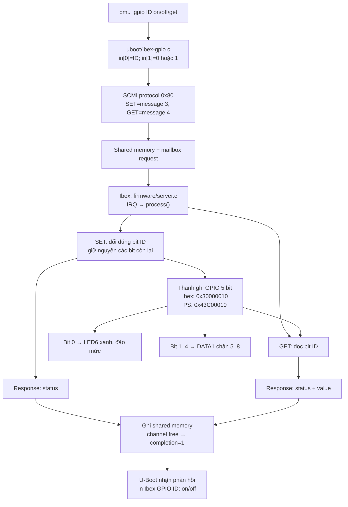

# Điều khiển LED6 và 4 ngõ ra DATA1 qua SCMI/Ibex

Ảnh boot hiện tại còn có [SCMI Clock điều khiển LED6 đỏ](SCMI_CLOCK_LED6.md).
Các kết quả GPIO bên dưới mô tả bản trước khi thêm Clock; hash ảnh hiện tại
nằm trong tài liệu Clock.

## Ánh xạ chân

| GPIO ID | Ngõ ra | Chân FPGA | Giá trị `on` |
|---|---|---|---|
| 0 | LED6 xanh | W13 | LED sáng (RTL đảo mức active-low) |
| 1 | DATA1 chân 5 | A20 | Mức cao 3,3 V |
| 2 | DATA1 chân 6 | H16 | Mức cao 3,3 V |
| 3 | DATA1 chân 7 | B19 | Mức cao 3,3 V |
| 4 | DATA1 chân 8 | B20 | Mức cao 3,3 V |

Nguồn ánh xạ: [EBAZ4205 Data Connectors](https://github.com/xjtuecho/EBAZ4205/wiki/Data-Connectors).
Các chân DATA1 này là ngõ ra cố định, không hỗ trợ chuyển hướng input.
Khi firmware khởi động, cả 5 giá trị logic đều bằng 0.

DATA1 chân 3/4 là GND, chân 1/2 là nguồn **12 V**. Chỉ nối tải/thiết bị
logic phù hợp 3,3 V vào chân GPIO, không đưa 5 V hoặc 12 V vào GPIO.
Nếu dùng LED ngoài, mắc điện trở nối tiếp và nối chung GND; không nối ngõ
ra này với một ngõ ra khác đang chủ động điều khiển mức điện.

## Lệnh

```text
ibexinit
pmu_gpio 0 on
pmu_gpio 1 on
pmu_gpio 2 on
pmu_gpio 3 off
pmu_gpio 4 on
pmu_gpio 2 get
pmu_gpio 2 off
pmu_gpio 2 get
```

`pmu_gpio on/off/get` không có ID vẫn dùng GPIO0, tương thích cú pháp cũ.
`get` đọc bit trong thanh ghi điều khiển, không đo mức điện ở chân ngoài.
Các ID ngoài 0..4 và thao tác ngoài on/off/get bị U-Boot từ chối.
Firmware cũng kiểm tra ID/giá trị để từ chối message SCMI không hợp lệ.

## Control và response

Lệnh U-Boot hiện dùng tên `pmu_gpio`; tên `ibexgpio` đã được thay thế.
`ibexinit` vẫn giữ tên cũ. Driver mailbox in log TX/RX cho cả GPIO và
SCMI discovery, đọc các word thực tế trong shared memory:

| Địa chỉ PS | Ý nghĩa |
|---|---|
| `0x43C01004` | Channel status: TX busy=0, RX free=1 |
| `0x43C01010` | Flags |
| `0x43C01014` | Length: header + payload, đơn vị byte |
| `0x43C01018` | Header: message ID, protocol, type và token |
| `0x43C0101C` | TX: GPIO ID; RX: mã status |
| `0x43C01020` | TX SET: giá trị 0/1; RX GET: giá trị đọc được |
| `0x43C00000` | Request doorbell: U-Boot ghi 1 |
| `0x43C00004` | Completion: U-Boot xóa 0 trước TX, nhận 1 và ACK bằng 0 |
| `0x43C00010` | Bitmap 5 GPIO, đọc sau response |

Ví dụ `pmu_gpio 1 on`: payload TX ở `0x43C0101C` bằng 1, payload TX
ở `0x43C01020` bằng 1, length bằng `0x0C`. Header lấy từ message thực tế
nên log hiển thị cả token do SCMI framework đặt. Khi thành công, status
RX bằng 0 và bit 1 trong GPIO bitmap được bật; các bit khác giữ nguyên.
Log là snapshot TX/RX và các lần ghi doorbell của driver, không phải
bản ghi từng giao dịch AXI; U-Boot không trực tiếp ghi thanh ghi GPIO.



SET dùng read-modify-write:

```c
REG(0x10) = (REG(0x10) & ~(1u << id)) | (value << id);
```

Ví dụ đang có GPIO1 và GPIO4 bật, bật GPIO2 chỉ đổi bit 2; GPIO1 và GPIO4
vẫn bật. GPIO protocol attributes báo 5 ngõ ra.

## Build

Thay đổi này sửa cả RTL, firmware và lệnh U-Boot, nên phải build cả ba.
PS clock/reset và địa chỉ mailbox giữ nguyên; dùng lại FSBL hiện có.

Từ thư mục `vivado/ibex_min/`:

```powershell
powershell.exe -NoProfile -ExecutionPolicy Bypass -File prepare.ps1
& 'D:/Xilinx/Vivado/2015.1/bin/vivado.bat' -mode batch -source resume.tcl -log build_gpio.log
wsl.exe bash -lc 'bash /mnt/e/EBAZ4205-PetaLinux-main/EBAZ4205-PetaLinux-main/vivado/ibex_min/uboot/build-client.sh'
& 'D:/Xilinx/SDK/2015.1/bin/bootgen.bat' -arch zynq -image boot.bif -o BOOT-GPIO.BIN -w on
```

`resume.tcl` dùng project đã tồn tại; `build.tcl` tạo project từ đầu.
Ảnh thử nghiệm được đặt tên `BOOT-GPIO.BIN`. Khi thử trên SD, sao lưu ảnh
đang chạy rồi chép ảnh thử nghiệm với tên `BOOT.BIN`.
Bản LED6 đã boot thành công được sao lưu trong `recovery_led6_boot/`.

## Kiểm tra

`tests/soc_tb.sv` kiểm tra SCMI SET/GET, số lượng GPIO, giữ nguyên các bit
không được chọn, từ chối ID sai, cùng các kiểm tra IRQ/WFI và AXI đã có.
Kết quả thực thi mô phỏng nằm trong `simulation_gpio_result.txt`.
Build và mô phỏng không thay thế việc xác minh mức điện trên bo.

Kết quả bản GPIO mở rộng:

- Firmware và U-Boot build thành công.
- Vivado tạo bitstream thành công; DRC 0 lỗi, có cảnh báo bus MIO dùng
  nhiều I/O standard theo cấu hình PS.
- Timing đạt: WNS 19,597 ns; WHS 0,037 ns; TNS/THS bằng 0.
- Mô phỏng PASS: 5 GPIO độc lập, 42 IRQ, SET/GET, lỗi ID/giá trị,
  WFI và AXI concurrency/byte strobes.
- U-Boot đã build lại với tên lệnh `pmu_gpio` và log TX/RX; build không có
  compiler warning/error. Firmware/bitstream dùng lại bản 5 GPIO đã mô phỏng.
- `BOOT-GPIO.BIN`: 3.143.048 byte, chưa thử bản lệnh/log mới trên bo.
- SHA256: `13F2E3F585A0D30CE2D057A2B13E46E24EA92AC6B5DB95F0ADFDA25059432A38`.
- `BOOT.BIN` cũ giữ nguyên, SHA256:
  `B2B4C7D54D9CF394771269B2AA8377AD533D7B04D65805CA011470F3627AC2FF`.
