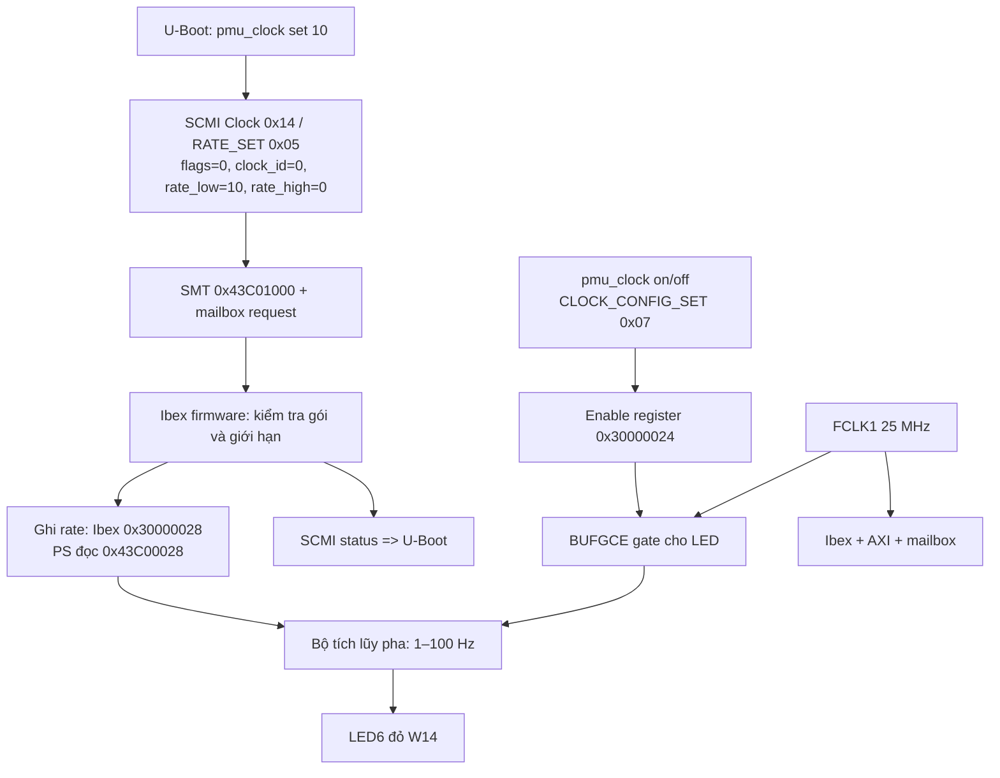

# Điều khiển clock LED6 đỏ qua SCMI/Ibex

`pmu_clock set <Hz>` đặt tần số nguyên từ **1 đến 100 Hz** cho clock ID 0 (`led6_red`). Mặc định sau reset: 1 Hz, clock tắt. FCLK1 cấp cho Ibex/AXI/mailbox vẫn là 25 MHz.

```text
ibexinit
pmu_clock set 10
pmu_clock rate
pmu_clock on
pmu_clock get
pmu_clock set 100
pmu_clock off
```

`set` giữ nguyên enable: đặt khi đang tắt không tự bật đèn. Đặt khi đang chạy bắt đầu chu kỳ mới, LED trở về tắt trước lần chuyển trạng thái tiếp theo. `off` giữ lại tần số; reset toàn hệ đưa về 1 Hz. `rate` đọc giá trị thực trong thanh ghi phần cứng. Lệnh từ chối 0, 101, số âm, số thập phân và chuỗi không phải số.

LED6 xanh (W13) vẫn dùng `pmu_gpio`; LED6 đỏ (W14, active-low) dùng `pmu_clock`. Ở tần số cao, mắt có thể thấy đèn sáng liên tục; kiểm tra dạng sóng bằng oscilloscope/logic analyzer.

## Luồng điều khiển



Bộ tích lũy pha cộng `2 × rate_hz` mỗi chu kỳ nguồn. Khi đạt 25.000.000, trừ ngưỡng và đảo LED. Vì giữ phần dư, mọi tần số nguyên 1–100 Hz có tần số trung bình đúng theo nguồn 25 MHz, kể cả các giá trị không chia hết 25.000.000. Sai khác thời điểm cạnh tối đa một chu kỳ nguồn (40 ns). Mô phỏng giảm ngưỡng để chạy nhanh; phần cứng dùng ngưỡng đầy đủ.

## Gói truyền và nhận

| Message | ID | TX payload (word 32 bit) | RX payload |
|---|---|---|---|
| CLOCK_ATTRIBUTES | 3 | clock ID | status, enable, tên 16 byte |
| CLOCK_DESCRIBE_RATES | 4 | clock ID, index=0 | status, flags=0x1003, min=1/0, max=100/0, step=1/0 |
| CLOCK_RATE_SET | 5 | flags=0, clock ID=0, rate low=1..100, rate high=0 | status |
| CLOCK_RATE_GET | 6 | clock ID | status, rate low, rate high=0 |
| CLOCK_CONFIG_SET | 7 | clock ID, enable=0/1 | status |

RATE_SET chỉ hỗ trợ đồng bộ, tần số chính xác, flags=0. Firmware từ chối flags khác 0, gói ngắn hoặc tần số ngoài giới hạn bằng INVALID_PARAMETERS (-2); clock ID khác 0 trả NOT_FOUND (-3). Yêu cầu lỗi không đổi tần số hoặc trạng thái enable.

Định dạng gói và triplet min/max/step theo [Arm SCMI specification, mục 4.6.2.5–4.6.2.6](https://documentation-service.arm.com/static/6231acfc8804d00769e9db69).

Ví dụ `pmu_clock set 10`, TX length gồm header là 20 byte:

```text
TX payload[0] [0x43c0101c] = 0x00000000 => flags: synchronous, exact rate
TX payload[1] [0x43c01020] = 0x00000000 => clock ID 0
TX payload[2] [0x43c01024] = 0x0000000a => requested rate low: 10 Hz
TX payload[3] [0x43c01028] = 0x00000000 => requested rate high
RX payload[0] [0x43c0101c] = 0x00000000 => status=0 (SUCCESS)
RX led_rate_hz [0x43c00028] = 0x0000000a => LED6 red blink rate in Hz
```

Đây là ví dụ định dạng, không phải log đo trên bo. Log thực tế có khối TX/RX riêng, số giao dịch và dấu `=>` giải nghĩa từng word.

## Các file và build

- [uboot/ibex-gpio.c](../../../vivado/ibex_min/uboot/ibex-gpio.c): cú pháp và đóng gói lệnh.
- [uboot/ibex-mbox.c](../../../vivado/ibex_min/uboot/ibex-mbox.c): log TX/RX.
- [firmware/scmi_protocols.h](../../../vivado/ibex_min/firmware/scmi_protocols.h): message ID, giới hạn, register offset.
- [firmware/server.c](../../../vivado/ibex_min/firmware/server.c): xử lý SCMI và ghi thanh ghi.
- [rtl/ibex_soc.v](../../../vivado/ibex_min/rtl/ibex_soc.v): rate register, BUFGCE, bộ tích lũy pha.
- [tests/soc_tb.sv](../../../vivado/ibex_min/tests/soc_tb.sv): kiểm tra đủ 100 tần số, readback, gói lỗi, bật/tắt, GPIO/WFI/AXI.
- [tests/run-clock-test.sh](../../../vivado/ibex_min/tests/run-clock-test.sh): chạy mô phỏng Verilator trong WSL.

Build firmware bằng `powershell -ExecutionPolicy Bypass -File vivado/ibex_min/prepare.ps1`, build U-Boot bằng `uboot/build-client.sh` trong WSL, build bitstream bằng `build.tcl`, đóng gói bằng `boot.bif`. Dùng lại FSBL có hỗ trợ NAND vì cấu hình PS không đổi. Xem [NAND_FSBL.md](NAND_FSBL.md).

Ảnh dùng với lệnh terminal `copy-boot-to-sd` là [BOOT-GPIO.BIN](../../../vivado/ibex_min/BOOT-GPIO.BIN). Kết quả build và hash bản đổi tần số nằm trong [clock_rate_build_verification.txt](clock_rate_build_verification.txt). Chưa thử bản mới trên bo.

Ảnh hiện tại còn bổ sung lệnh cập nhật SD qua JTAG; hash mới xem tại
[JTAG_CPU_SDCARD.md](JTAG_CPU_SDCARD.md). Tính năng clock 1–100 Hz vẫn được giữ nguyên.
