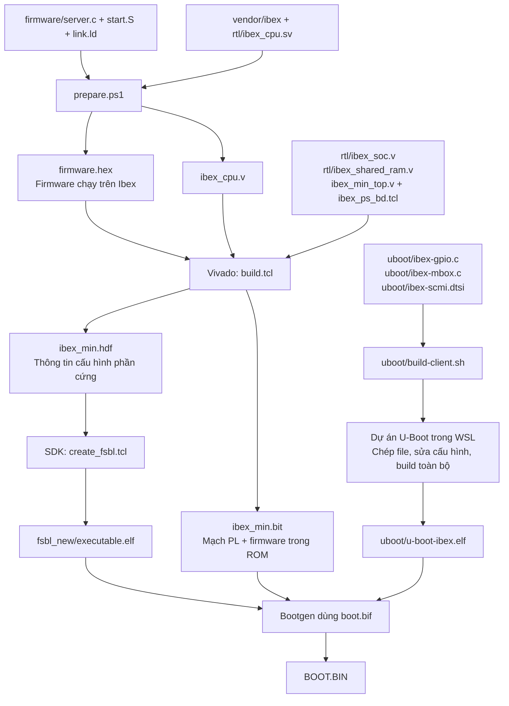
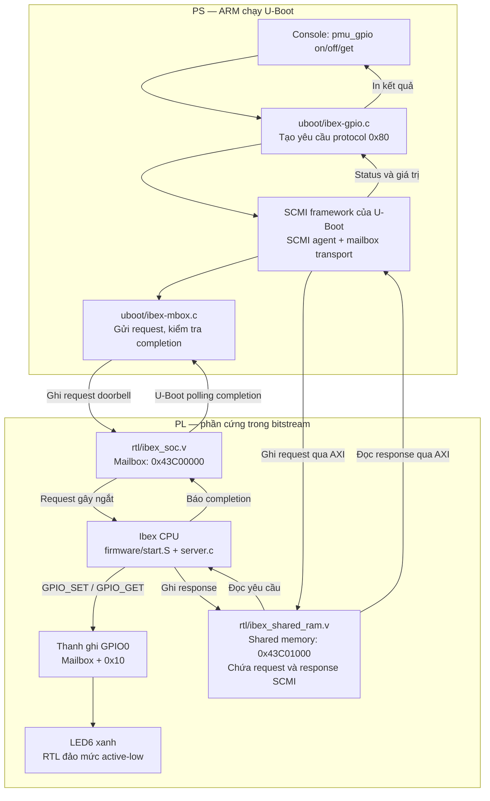
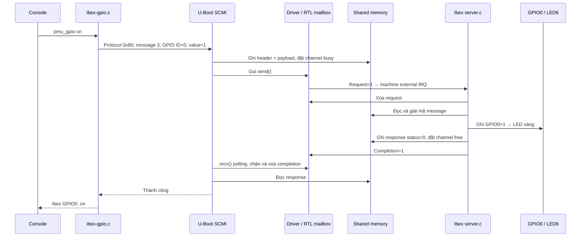
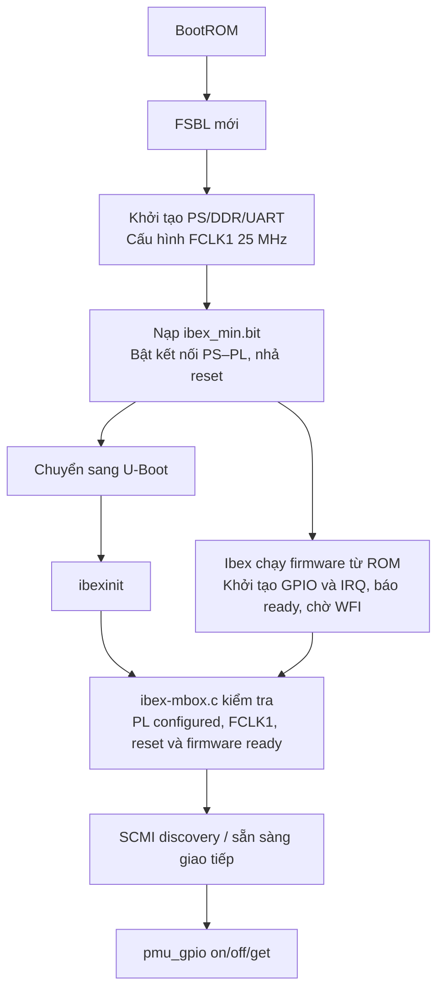

# Sơ đồ U-Boot → SCMI → Ibex → GPIO → Response

Các đường dẫn trong tài liệu tính từ `vivado/ibex_min/`.
Mở Markdown Preview có hỗ trợ Mermaid để xem sơ đồ.

Xem thêm [sơ đồ SCMI Clock cho LED6 đỏ](SCMI_CLOCK_LED6.md).

Đã mở rộng GPIO0 (LED6) thành 5 ngõ ra: GPIO1..4 ở DATA1 chân 5..8.
Các ví dụ GPIO0 bên dưới vẫn áp dụng; dùng `pmu_gpio ID on/off/get` để chọn
ngõ ra. Xem [sơ đồ và ánh xạ nhiều GPIO](GPIO_DATA1.md).

## 1. Mối liên hệ các file khi build

`server.c` được biên dịch thành mã RISC-V chạy trên Ibex và nhúng vào bitstream.
`ibex-gpio.c` và `ibex-mbox.c` được biên dịch thành mã ARM chạy trong U-Boot.

`uboot/` ở đây chứa phần bổ sung cho Ibex. `build-client.sh` chép các file sang
dự án U-Boot đầy đủ, mặc định tại `/home/vund19/ebaz-dev/u-boot` trong WSL.
Script lấy cấu hình từ `out/.config`, sửa Kconfig/Makefile và DTS, build toàn bộ
U-Boot vào `out-ibex/`, rồi chép ELF về `uboot/u-boot-ibex.elf`.
Chạy script sẽ ghi đè các file Ibex tương ứng trong dự án U-Boot bằng bản ở đây.

## 2. Sơ đồ hệ thống khi chạy

SCMI là định dạng và quy tắc trao đổi message. Shared memory chứa nội dung
message; mailbox báo có yêu cầu hoặc đã xử lý xong.

`uboot/ibex-scmi.dtsi` khai báo địa chỉ và nối SCMI agent với mailbox/shared
memory. Node SCMI có `status = "disabled"` để được bind chủ động sau khi vào
console. `ibex_min_top.v` nối AXI của PS vào `ibex_soc` và đưa clock/reset
đến mạch Ibex.

## 3. Trình tự lệnh và phản hồi

Phía Ibex chờ ngắt bằng `wfi`; phía U-Boot polling completion để đợi phản hồi.

| Lệnh trên console | Xử lý |
|---|---|
| `ibexinit` | Bind SCMI agent, kiểm tra FCLK1/reset/firmware ready, thực hiện discovery |
| `scmi info` | Xem thông tin SCMI |
| `pmu_gpio on` | Protocol `0x80`, message `3`: SET GPIO0 = 1 |
| `pmu_gpio off` | Protocol `0x80`, message `3`: SET GPIO0 = 0 |
| `pmu_gpio get` | Protocol `0x80`, message `4`: GET giá trị thanh ghi GPIO0 |

Với SET, firmware trả status; U-Boot in giá trị vừa yêu cầu nếu thành công.
Với GET, firmware trả status và giá trị GPIO0. Giá trị GET là trạng thái thanh
ghi điều khiển, không phải đo lại mức điện trên chân LED.

## 4. Khởi động và vai trò FSBL

FSBL cấu hình clock/reset. Dòng `PL configured; checking FCLK1` trong driver
U-Boot chỉ kiểm tra cấu hình đã có, không cấu hình lại clock và không reset Ibex.

## 5. Các file để đọc code

| File | Vai trò |
|---|---|
| [uboot/ibex-gpio.c](../../../vivado/ibex_min/uboot/ibex-gpio.c) | Đăng ký `ibexinit`, `pmu_gpio`; tạo message và in kết quả |
| [uboot/ibex-mbox.c](../../../vivado/ibex_min/uboot/ibex-mbox.c) | Kiểm tra phần cứng, gửi doorbell, nhận completion |
| [uboot/ibex-scmi.dtsi](../../../vivado/ibex_min/uboot/ibex-scmi.dtsi) | Khai báo SCMI, mailbox, shared memory và clock |
| [uboot/build-client.sh](../../../vivado/ibex_min/uboot/build-client.sh) | Tích hợp phần Ibex và build toàn bộ U-Boot |
| [firmware/server.c](../../../vivado/ibex_min/firmware/server.c) | SCMI server trên Ibex; xử lý IRQ, GPIO và response |
| [firmware/start.S](../../../vivado/ibex_min/firmware/start.S) | Khởi động firmware và thiết lập vector ngắt |
| [firmware/link.ld](../../../vivado/ibex_min/firmware/link.ld) | Bố trí firmware trong bộ nhớ Ibex |
| [rtl/ibex_soc.v](../../../vivado/ibex_min/rtl/ibex_soc.v) | Phần cứng SoC Ibex, mailbox, GPIO và IRQ |
| [rtl/ibex_shared_ram.v](../../../vivado/ibex_min/rtl/ibex_shared_ram.v) | Bộ nhớ trao đổi message giữa PS và Ibex |
| [ibex_min_top.v](../../../vivado/ibex_min/ibex_min_top.v) | Kết nối PS, AXI, clock/reset và SoC Ibex |
| [prepare.ps1](../../../vivado/ibex_min/prepare.ps1) | Build firmware, tạo hex và chuyển RTL Ibex sang Verilog |
| [build.tcl](../../../vivado/ibex_min/build.tcl) | Build phần cứng bằng Vivado |
| [create_fsbl.tcl](../../../vivado/ibex_min/create_fsbl.tcl) | Tạo FSBL từ HDF bằng SDK |
| [boot.bif](../../../vivado/ibex_min/boot.bif) | Danh sách FSBL, bitstream và U-Boot cho Bootgen |
